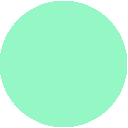

  

<h3 align="center">Decay Theme</h3>

Decay is a theme that uses shades of green along with a dark-toned background for better contrast!. The
contrast between background and primary color helps avoid any eye fatigue when spending a
lot of time in front of the computer.

  
  
  

# Palettes

Currently decay provides 3 palettes:

- Dark Decay
- Decayce
- Light Decay

## Dark Decay

<table>
  <thead>
    <tr>
      <th>Preview</th>
      <th>Hex</th>
      <th>Description</th>
    </tr>
  </thead>
  <tbody>
    <tr>
      <td>

</td>
      <td>#040405</td>
      <td>Background 5</td>
    </tr>
    <tr>
      <td>

</td>
      <td>#07080a</td>
      <td>Background 4</td>
    </tr>
    <tr>
      <td>

</td>
      <td>#0a0c0f</td>
      <td>Background 3</td>
    </tr>
    <tr>
      <td>

</td>
      <td>#0d1014</td>
      <td>Background 2</td>
    </tr>
    <tr>
      <td>

</td>
      <td>#101419</td>
      <td>Background</td>
    </tr>
    <tr>
      <td>

</td>
      <td>#6b7078</td>
      <td>Foreground 5</td>
    </tr>
    <tr>
      <td>

</td>
      <td>#777c85</td>
      <td>Foreground 4</td>
    </tr>
    <tr>
      <td>

</td>
      <td>#8c929c</td>
      <td>Foreground 3</td>
    </tr>
    <tr>
      <td>

</td>
      <td>#a1a8b3</td>
      <td>Foreground 2</td>
    </tr>
    <tr>
      <td>

</td>
      <td>#b6beca</td>
      <td>Foreground</td>
    </tr>
    <tr>
      <td>

</td>
      <td>#020203</td>
      <td>Black 3</td>
    </tr>
    <tr>
      <td>

</td>
      <td>#0f1317</td>
      <td>Black 2</td>
    </tr>
    <tr>
      <td>

</td>
      <td>#1c252c</td>
      <td>Black</td>
    </tr>
    <tr>
      <td>

</td>
      <td>#181c1f</td>
      <td>Bright Black 5</td>
    </tr>
    <tr>
      <td>

</td>
      <td>#202529</td>
      <td>Bright Black 4</td>
    </tr>
    <tr>
      <td>

</td>
      <td>#282e33</td>
      <td>Bright Black 3</td>
    </tr>
    <tr>
      <td>

</td>
      <td>#30373d</td>
      <td>Bright Black 2</td>
    </tr>
    <tr>
      <td>

</td>
      <td>#384148</td>
      <td>Bright Black</td>
    </tr>
    <tr>
      <td>

</td>
      <td>#8f3c41</td>
      <td>Red 5</td>
    </tr>
    <tr>
      <td>

</td>
      <td>#a3454a</td>
      <td>Red 4</td>
    </tr>
    <tr>
      <td>

</td>
      <td>#b84e53</td>
      <td>Red 3</td>
    </tr>
    <tr>
      <td>

</td>
      <td>#cc575c</td>
      <td>Red 2</td>
    </tr>
    <tr>
      <td>

</td>
      <td>#e05f65</td>
      <td>Red</td>
    </tr>
    <tr>
      <td>

</td>
      <td>#ab5358</td>
      <td>Bright Red 5</td>
    </tr>
    <tr>
      <td>

</td>
      <td>#bf5d62</td>
      <td>Bright Red 4</td>
    </tr>
    <tr>
      <td>

</td>
      <td>#d4676d</td>
      <td>Bright Red 3</td>
    </tr>
    <tr>
      <td>

</td>
      <td>#e87177</td>
      <td>Bright Red 2</td>
    </tr>
    <tr>
      <td>

</td>
      <td>#e5646a</td>
      <td>Bright Red</td>
    </tr>
    <tr>
      <td>

</td>
      <td>#579e79</td>
      <td>Green 4</td>
    </tr>
    <tr>
      <td>

</td>
      <td>#62b389</td>
      <td>Green 3</td>
    </tr>
    <tr>
      <td>

</td>
      <td>#6dc799</td>
      <td>Green 2</td>
    </tr>
    <tr>
      <td>

</td>
      <td>#78dba9</td>
      <td>Green</td>
    </tr>
    <tr>
      <td>

</td>
      <td>#66ab88</td>
      <td>Bright Green 5</td>
    </tr>
    <tr>
      <td>

</td>
      <td>#71bd97</td>
      <td>Bright Green 4</td>
    </tr>
    <tr>
      <td>

</td>
      <td>#7dd1a7</td>
      <td>Bright Green 3</td>
    </tr>
    <tr>
      <td>

</td>
      <td>#88e3b5</td>
      <td>Bright Green 2</td>
    </tr>
    <tr>
      <td>

</td>
      <td>#94F7C5</td>
      <td>Bright Green</td>
    </tr>
    <tr>
      <td>

</td>
      <td>#a38c5d</td>
      <td>Yellow 5</td>
    </tr>
    <tr>
      <td>

</td>
      <td>#b89e69</td>
      <td>Yellow 4</td>
    </tr>
    <tr>
      <td>

</td>
      <td>#ccb075</td>
      <td>Yellow 3</td>
    </tr>
    <tr>
      <td>

</td>
      <td>#debf7f</td>
      <td>Yellow 2</td>
    </tr>
    <tr>
      <td>

</td>
      <td>#f1cf8a</td>
      <td>Yellow</td>
    </tr>
    <tr>
      <td>

</td>
      <td>#ad9f71</td>
      <td>Bright Yellow 5</td>
    </tr>
    <tr>
      <td>

</td>
      <td>#c2b27e</td>
      <td>Bright Yellow 4</td>
    </tr>
    <tr>
      <td>

</td>
      <td>#d6c58b</td>
      <td>Bright Yellow 3</td>
    </tr>
    <tr>
      <td>

</td>
      <td>#ebd899</td>
      <td>Bright Yellow 2</td>
    </tr>
    <tr>
      <td>

</td>
      <td>#f6d48f</td>
      <td>Bright Yellow</td>
    </tr>
    <tr>
      <td>

</td>
      <td>#527aad</td>
      <td>Blue 4</td>
    </tr>
    <tr>
      <td>

</td>
      <td>#5c88c2</td>
      <td>Blue 3</td>
    </tr>
    <tr>
      <td>

</td>
      <td>#6696d6</td>
      <td>Blue 2</td>
    </tr>
    <tr>
      <td>

</td>
      <td>#70a5eb</td>
      <td>Blue</td>
    </tr>
    <tr>
      <td>

</td>
      <td>#6083ad</td>
      <td>Bright Blue 5</td>
    </tr>
    <tr>
      <td>

</td>
      <td>#6b93c2</td>
      <td>Bright Blue 4</td>
    </tr>
    <tr>
      <td>

</td>
      <td>#76a2d6</td>
      <td>Bright Blue 3</td>
    </tr>
    <tr>
      <td>

</td>
      <td>#81b2eb</td>
      <td>Bright Blue 2</td>
    </tr>
    <tr>
      <td>

</td>
      <td>#75aaf0</td>
      <td>Bright Blue</td>
    </tr>
    <tr>
      <td>

</td>
      <td>#815a9c</td>
      <td>Magenta 5</td>
    </tr>
    <tr>
      <td>

</td>
      <td>#9266b0</td>
      <td>Magenta 4</td>
    </tr
    <tr>
      <td>

</td>
      <td>#a372c4</td>
      <td>Magenta 3</td>
    </tr>
    <tr>
      <td>

</td>
      <td>#b47ed9</td>
      <td>Magenta 2</td>
    </tr>
    <tr>
      <td>

</td>
      <td>#c68aee</td>
      <td>Magenta</td>
    </tr>
    <tr>
      <td>

</td>
      <td>#9a71ad</td>
      <td>Bright Magenta 5</td>
    </tr>
    <tr>
      <td>

</td>
      <td>#ac7ec2</td>
      <td>Bright Magenta 4</td>
    </tr>
    <tr>
      <td>

</td>
      <td>#be8bd6</td>
      <td>Bright Magenta 3</td>
    </tr>
    <tr>
      <td>

</td>
      <td>#d099eb</td>
      <td>Bright Magenta 2</td>
    </tr>
    <tr>
      <td>

</td>
      <td>#cb8ff3</td>
      <td>Bright Magenta</td>
    </tr>
    <tr>
      <td>

</td>
      <td>#4b7b96</td>
      <td>Cyan 5</td>
    </tr>
    <tr>
      <td>

</td>
      <td>#558cab</td>
      <td>Cyan 4</td>
    </tr>
    <tr>
      <td>

</td>
      <td>#5f9cbf</td>
      <td>Cyan 3</td>
    </tr>
    <tr>
      <td>

</td>
      <td>#69add4</td>
      <td>Cyan 2</td>
    </tr>
    <tr>
      <td>

</td>
      <td>#74bee9</td>
      <td>Cyan</td>
    </tr>
    <tr>
      <td>

</td>
      <td>#6194ad</td>
      <td>Bright Cyan</td>
    </tr>
    <tr>
      <td>

</td>
      <td>#6da6c2</td>
      <td>Bright Cyan 4</td>
    </tr>
    <tr>
      <td>

</td>
      <td>#78b7d6</td>
      <td>Bright Cyan 3</td>
    </tr>
    <tr>
      <td>

</td>
      <td>#84c9eb</td>
      <td>Bright Cyan 2</td>
    </tr>
    <tr>
      <td>

</td>
      <td>#79c3ee</td>
      <td>Bright Cyan</td>
    </tr>
    <tr>
      <td>

</td>
      <td>#8f9194</td>
      <td>White 5</td>
    </tr>
    <tr>
      <td>

</td>
      <td>#a2a5a8</td>
      <td>White 4</td>
    </tr>
    <tr>
      <td>

</td>
      <td>#b6b9bd</td>
      <td>White 3</td>
    </tr>
    <tr>
      <td>

</td>
      <td>#cacdd1</td>
      <td>White 2</td>
    </tr>
    <tr>
      <td>

</td>
      <td>#dee1e6</td>
      <td>White</td>
    </tr>
    <tr>
      <td>

</td>
      <td>#acaeb0</td>
      <td>Bright White 5</td>
    </tr>
    <tr>
      <td>

</td>
      <td>#bec0c2</td>
      <td>Bright White 4</td>
    </tr>
    <tr>
      <td>

</td>
      <td>#d2d4d6</td>
      <td>Bright White 3</td>
    </tr>
    <tr>
      <td>

</td>
      <td>#e6e9eb</td>
      <td>Bright White 2</td>
    </tr>
    <tr>
      <td>

</td>
      <td>#e3e6eb</td>
      <td>Bright White</td>
    </tr>
  </tbody>
</table>

## Decayce

<table>
  <thead>
    <tr>
      <th>Preview</th>
      <th>Hex</th>
      <th>Description</th>
    </tr>
  </thead>
  <tbody>
    <tr>
      <td>

</td>
      <td>#000008</td>
      <td>Background 3</td>
    </tr>
    <tr>
      <td>

</td>
      <td>#050710</td>
      <td>Background 2</td>
    </tr>
    <tr>
      <td>

</td>
      <td>#0d0f18</td>
      <td>Background</td>
    </tr>
    <tr>
      <td>

</td>
      <td>#8596af</td>
      <td>Foreground 4</td>
    </tr>
    <tr>
      <td>

</td>
      <td>#8d9eb7</td>
      <td>Foreground 3</td>
    </tr>
    <tr>
      <td>

</td>
      <td>#9daec7</td>
      <td>Foreground 2</td>
    </tr>
    <tr>
      <td>

</td>
      <td>#a5b6cf</td>
      <td>Foreground</td>
    </tr>
    <tr>
      <td>

</td>
      <td>#bd4757</td>
      <td>Red 5</td>
    </tr>
    <tr>
      <td>

</td>
      <td>#c54f5f</td>
      <td>Red 4</td>
    </tr>
    <tr>
      <td>

</td>
      <td>#cd5767</td>
      <td>Red 3</td>
    </tr>
    <tr>
      <td>

</td>
      <td>#d55f6f</td>
      <td>Red 2</td>
    </tr>
    <tr>
      <td>

</td>
      <td>#dd6777</td>
      <td>Red</td>
    </tr>
    <tr>
      <td>

</td>
      <td>#c24c5c</td>
      <td>Bright Red 5</td>
    </tr>
    <tr>
      <td>

</td>
      <td>#ca5464</td>
      <td>Bright Red 4</td>
    </tr>
    <tr>
      <td>

</td>
      <td>#d25c6c</td>
      <td>Bright Red 3</td>
    </tr>
    <tr>
      <td>

</td>
      <td>#da6474</td>
      <td>Bright Red 2</td>
    </tr>
    <tr>
      <td>

</td>
      <td>#e26c7c</td>
      <td>Bright Red</td>
    </tr>
    <tr>
      <td>

</td>
      <td>#70ae8a</td>
      <td>Green 5</td>
    </tr>
    <tr>
      <td>

</td>
      <td>#78b692</td>
      <td>Green 4</td>
    </tr>
    <tr>
      <td>

</td>
      <td>#80be9a</td>
      <td>Green 3</td>
    </tr>
    <tr>
      <td>

</td>
      <td>#88c6a2w</td>
      <td>Green 2</td>
    </tr>
    <tr>
      <td>

</td>
      <td>#90ceaa</td>
      <td>Green</td>
    </tr>
    <tr>
      <td>

</td>
      <td>#75b38f</td>
      <td>Bright Green 5</td>
    </tr>
    <tr>
      <td>

</td>
      <td>#7dbb97</td>
      <td>Bright Green 4</td>
    </tr>
    <tr>
      <td>

</td>
      <td>#85c39f</td>
      <td>Bright Green 3</td>
    </tr>
    <tr>
      <td>

</td>
      <td>#8dcba7</td>
      <td>Bright Green 2</td>
    </tr>
    <tr>
      <td>

</td>
      <td>#95d3af</td>
      <td>Bright Green</td>
    </tr>
    <tr>
      <td>

</td>
      <td>#ccb380</td>
      <td>Yellow 5</td>
    </tr>
    <tr>
      <td>

</td>
      <td>#d4bb88</td>
      <td>Yellow 4</td>
    </tr>
    <tr>
      <td>

</td>
      <td>#dcc390</td>
      <td>Yellow 3</td>
    </tr>
    <tr>
      <td>

</td>
      <td>#e4cb98</td>
      <td>Yellow 2</td>
    </tr>
    <tr>
      <td>

</td>
      <td>#ecd3a0</td>
      <td>Yellow</td>
    </tr>
    <tr>
      <td>

</td>
      <td>#d1b885</td>
      <td>Bright Yellow 5</td>
    </tr>
    <tr>
      <td>

</td>
      <td>#d9c08d</td>
      <td>Bright Yellow 4</td>
    </tr>
    <tr>
      <td>

</td>
      <td>#e1c895</td>
      <td>Bright Yellow 3</td>
    </tr>
    <tr>
      <td>

</td>
      <td>#e9d09d</td>
      <td>Bright Yellow 2</td>
    </tr>
    <tr>
      <td>

</td>
      <td>#f1d8a5</td>
      <td>Bright Yellow</td>
    </tr>
    <tr>
      <td>

</td>
      <td>#668acc</td>
      <td>Blue 5</td>
    </tr>
    <tr>
      <td>

</td>
      <td>#6e92d4</td>
      <td>Blue 4</td>
    </tr>
    <tr>
      <td>

</td>
      <td>#769adc</td>
      <td>Blue 3</td>
    </tr>
    <tr>
      <td>

</td>
      <td>#7ea2e4</td>
      <td>Blue 2</td>
    </tr>
    <tr>
      <td>

</td>
      <td>#86aaec</td>
      <td>Blue</td>
    </tr>
    <tr>
      <td>

</td>
      <td>#6b8fd1</td>
      <td>Bright Blue 4</td>
    </tr>
    <tr>
      <td>

</td>
      <td>#7b9fe1</td>
      <td>Bright Blue 3</td>
    </tr>
    <tr>
      <td>

</td>
      <td>#83a7e9</td>
      <td>Bright Blue 2</td>
    <tr>
      <td>

</td>
      <td>#8baff1</td>
      <td>Bright Blue</td>
    </tr>
    <tr>
      <td>

</td>
      <td>#a77bd0</td>
      <td>Magenta 5</td>
    </tr>
    <tr>
      <td>

</td>
      <td>#af83d8</td>
      <td>Magenta 4</td>
    </tr>
    <tr>
      <td>

</td>
      <td>#b78be0</td>
      <td>Magenta 3</td>
    </tr>
    <tr>
      <td>

</td>
      <td>#bf93e8</td>
      <td>Magenta 2</td>
    </tr>
    <tr>
      <td>

</td>
      <td>#c296eb</td>
      <td>Magenta</td>
    </tr>
    <tr>
      <td>

</td>
      <td>#a77bd0</td>
      <td>Bright Magenta 5</td>
    </tr>
    <tr> 
      <td>

</td>
      <td>#af83d8</td>
      <td>Bright Magenta 4</td>
    </tr>
    <tr> 
      <td>

</td>
      <td>#b78be0</td>
      <td>Bright Magenta 3</td>
    </tr>
    <tr> 
      <td>

</td>
      <td>#bf93e8</td>
      <td>Bright Magenta 2</td>
    </tr> 
    <tr> 
      <td>

</td>
      <td>#c79bf0</td>
      <td>Bright Magenta</td>
    </tr>
    <tr>
      <td>

</td>
      <td>#73aec9</td>
      <td>Cyan 5</td>
    </tr>
    <tr>
      <td>

</td>
      <td>#7bb6d1</td>
      <td>Cyan 4</td>
    </tr>
    <tr>
      <td>

</td>
      <td>#83bed9</td>
      <td>Cyan 3</td>
    </tr>
    <tr>
      <td>

</td>
      <td>#8bc6e1</td>
      <td>Cyan 2</td>
    </tr>
    <tr>
      <td>

</td>
      <td>#93cee9</td>
      <td>Cyan</td>
    </tr>
    <tr>
      <td>

</td>
      <td>#98d3ee</td>
      <td>Bright Cyan 5</td>
    </tr>
    <tr>
      <td>

</td>
      <td>#88c3de</td>
      <td>Bright Cyan 4</td>
    </tr>
    <tr>
      <td>

</td>
      <td>#90cbe6</td>
      <td>Bright Cyan 3</td>
    </tr>
    <tr>
      <td>

</td>
      <td>#80bbd6</td>
      <td>Bright Cyan 2</td>
    </tr>
    <tr>
      <td>

</td>
      <td>#78b3ce</td>
      <td>Bright Cyan</td>
    </tr>
    <tr>
      <td>

</td>
      <td>#abaeb3</td>
      <td>White 5</td>
    </tr>
    <tr>
      <td>

</td>
      <td>#b3b6bb</td>
      <td>White 4</td>
    </tr>
    <tr>
      <td>

</td>
      <td>#bbbec3</td>
      <td>White 3</td>
    </tr> 
    <tr>
      <td>

</td>
      <td>#c3c6cb</td>
      <td>White 2</td>
    </tr>
    <tr>
      <td>

</td>
      <td>#d0d3d8</td>
      <td>White</td>
    </tr>
    <tr>
      <td>

</td>
      <td>#b0b3b8</td>
      <td>Bright White 4</td>
    </tr>
    <tr>
      <td>

</td>
      <td>#b8bbc0</td>
      <td>Bright White 3</td>
    </tr>
    <tr>
      <td>

</td>
      <td>#c0c3c8</td>
      <td>Bright White 2</td>
    </tr>
    <tr>
      <td>

</td>
      <td>#c8cbd0</td>
      <td>Bright White</td>
    </tr>
  </tbody>
</table>

## Light Decay

<table>
  <thead>
    <tr>
      <th>Preview</th>
      <th>Hex</th>
      <th>Description</th>
    </tr>
  </thead>
  <tbody>
    <tr>
      <td>

</td>
      <td>#dee1e6</td>
      <td>Background</td>
    </tr>
    <tr>
      <td>

</td>
      <td>#101419</td>
      <td>Foreground</td>
    </tr>
    <tr>
      <td>

</td>
      <td>#bd3c42</td>
      <td>Red</td>
    </tr>
    <tr>
      <td>

</td>
      <td>#c24147</td>
      <td>Bright Red</td>
    </tr>
    <tr>
      <td>

</td>
      <td>#69b373</td>
      <td>Green</td>
    </tr>
    <tr>
      <td>

</td>
      <td>#6eb878</td>
      <td>Bright Green</td>
    </tr>
    <tr>
      <td>

</td>
      <td>#ceac67</td>
      <td>Yellow</td>
    </tr>
    <tr>
      <td>

</td>
      <td>#d3b16c</td>
      <td>Bright Yellow</td>
    </tr>
    <tr>
      <td>

</td>
      <td>#4d82c8</td>
      <td>Blue</td>
    </tr>
    <tr>
      <td>

</td>
      <td>#5287cd</td>
      <td>Bright Blue</td>
    </tr>
    <tr>
      <td>

</td>
      <td>#a367cb</td>
      <td>Magenta</td>
    </tr>
    <tr>
      <td>

</td>
      <td>#a86cd0</td>
      <td>Bright Magenta</td>
    </tr>
    <tr>
      <td>

</td>
      <td>#519bc6</td>
      <td>Cyan</td>
    </tr>
    <tr>
      <td>

</td>
      <td>#56a0cb</td>
      <td>Bright Cyan</td>
    </tr>
    <tr>
      <td>

</td>
      <td>#101419</td>
      <td>White (Black because light decay is a light theme)</td>
    </tr>
    <tr>
      <td>

</td>
      <td>#1f2328</td>
      <td>Bright White (same applies here)</td>
    </tr>
  </tbody>
</table>
