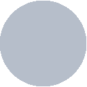
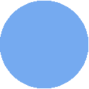

  

<h3 align="center">Decay Theme</h3>

Decay is a theme that uses shades of green along with a dark-toned background for better contrast!. The
contrast between background and primary color helps avoid any eye fatigue when spending a
lot of time in front of the computer.

  
  
  

# Palettes

Currently decay provides 3 palettes:

- Dark Decay
- Decayce
- Light Decay

## Dark Decay

<table>
  <thead>
    <tr>
      <th>Preview</th>
      <th>Hex</th>
      <th>Description</th>
    </tr>
  </thead>
  <tbody>
    <tr>
      <td>

</td>
      <td>#101419</td>
      <td>Background</td>
    </tr>
    <tr>
      <td>

</td>
      <td>#b6beca</td>
      <td>Foreground</td>
    </tr>
    <tr>
      <td>

</td>
      <td>#e05f65</td>
      <td>Red</td>
    </tr>
    <tr>
      <td>

</td>
      <td>#e5646a</td>
      <td>Bright Red</td>
    </tr>
    <tr>
      <td>

</td>
      <td>#78dba9</td>
      <td>Green</td>
    </tr>
    <tr>
      <td>

</td>
      <td>#94F7C5</td>
      <td>Bright Green</td>
    </tr>
    <tr>
      <td>

</td>
      <td>#f1cf8a</td>
      <td>Yellow</td>
    </tr>
    <tr>
      <td>

</td>
      <td>#f6d48f</td>
      <td>Bright Yellow</td>
    </tr>
    <tr>
      <td>

</td>
      <td>#70a5eb</td>
      <td>Blue</td>
    </tr>
    <tr>
      <td>

</td>
      <td>#75aaf0</td>
      <td>Bright Blue</td>
    </tr>
    <tr>
      <td>

</td>
      <td>#c68aee</td>
      <td>Magenta</td>
    </tr>
    <tr>
      <td>

</td>
      <td>#cb8ff3</td>
      <td>Bright Magenta</td>
    </tr>
    <tr>
      <td>

</td>
      <td>#74bee9</td>
      <td>Cyan</td>
    </tr>
    <tr>
      <td>

</td>
      <td>#79c3ee</td>
      <td>Bright Cyan</td>
    </tr>
    <tr>
      <td>

</td>
      <td>#dee1e6</td>
      <td>White</td>
    </tr>
    <tr>
      <td>

</td>
      <td>#e3e6eb</td>
      <td>Bright White</td>
    </tr>
  </tbody>
</table>

## Decayce

<table>
  <thead>
    <tr>
      <th>Preview</th>
      <th>Hex</th>
      <th>Description</th>
    </tr>
  </thead>
  <tbody>
    <tr>
      <td>

</td>
      <td>#0d0f18</td>
      <td>Background</td>
    </tr>
    <tr>
      <td>

</td>
      <td>#a5b6cf</td>
      <td>Foreground</td>
    </tr>
    <tr>
      <td>

</td>
      <td>#dd6777</td>
      <td>Red</td>
    </tr>
    <tr>
      <td>

</td>
      <td>#e26c7c</td>
      <td>Bright Red</td>
    </tr>
    <tr>
      <td>

</td>
      <td>#90ceaa</td>
      <td>Green</td>
    </tr>
    <tr>
      <td>

</td>
      <td>#95d3af</td>
      <td>Bright Green</td>
    </tr>
    <tr>
      <td>

</td>
      <td>#ecd3a0</td>
      <td>Yellow</td>
    </tr>
    <tr>
      <td>

</td>
      <td>#f1d8a5</td>
      <td>Bright Yellow</td>
    </tr>
    <tr>
      <td>

</td>
      <td>#86aaec</td>
      <td>Blue</td>
    </tr>
    <tr>
      <td>

</td>
      <td>#8baff1</td>
      <td>Bright Blue</td>
    </tr>
    <tr>
      <td>

</td>
      <td>#c296eb</td>
      <td>Magenta</td>
    </tr>
    <tr>
      <td>

</td>
      <td>#c79bf0</td>
      <td>Bright Magenta</td>
    </tr>
    <tr>
      <td>

</td>
      <td>#93cee9</td>
      <td>Cyan</td>
    </tr>
    <tr>
      <td>

</td>
      <td>#98d3ee</td>
      <td>Bright Cyan</td>
    </tr>
    <tr>
      <td>

</td>
      <td>#cbced3</td>
      <td>White</td>
    </tr>
    <tr>
      <td>

</td>
      <td>#d0d3d8</td>
      <td>Bright White</td>
    </tr>
  </tbody>
</table>

## Light Decay

<table>
  <thead>
    <tr>
      <th>Preview</th>
      <th>Hex</th>
      <th>Description</th>
    </tr>
  </thead>
  <tbody>
    <tr>
      <td>

</td>
      <td>#dee1e6</td>
      <td>Background</td>
    </tr>
    <tr>
      <td>

</td>
      <td>#101419</td>
      <td>Foreground</td>
    </tr>
    <tr>
      <td>

</td>
      <td>#bd3c42</td>
      <td>Red</td>
    </tr>
    <tr>
      <td>

</td>
      <td>#c24147</td>
      <td>Bright Red</td>
    </tr>
    <tr>
      <td>

</td>
      <td>#69b373</td>
      <td>Green</td>
    </tr>
    <tr>
      <td>

</td>
      <td>#6eb878</td>
      <td>Bright Green</td>
    </tr>
    <tr>
      <td>

</td>
      <td>#ceac67</td>
      <td>Yellow</td>
    </tr>
    <tr>
      <td>

</td>
      <td>#d3b16c</td>
      <td>Bright Yellow</td>
    </tr>
    <tr>
      <td>

</td>
      <td>#4d82c8</td>
      <td>Blue</td>
    </tr>
    <tr>
      <td>

</td>
      <td>#5287cd</td>
      <td>Bright Blue</td>
    </tr>
    <tr>
      <td>

</td>
      <td>#a367cb</td>
      <td>Magenta</td>
    </tr>
    <tr>
      <td>

</td>
      <td>#a86cd0</td>
      <td>Bright Magenta</td>
    </tr>
    <tr>
      <td>

</td>
      <td>#519bc6</td>
      <td>Cyan</td>
    </tr>
    <tr>
      <td>

</td>
      <td>#56a0cb</td>
      <td>Bright Cyan</td>
    </tr>
    <tr>
      <td>

</td>
      <td>#101419</td>
      <td>White (Black because light decay is a light theme)</td>
    </tr>
    <tr>
      <td>

</td>
      <td>#1f2328</td>
      <td>Bright White (same applies here)</td>
    </tr>
  </tbody>
</table>
